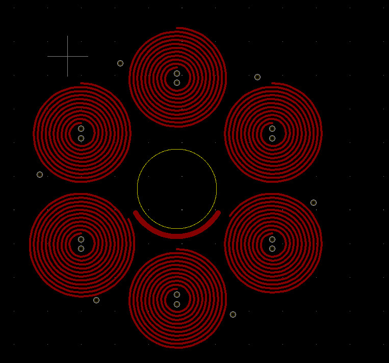
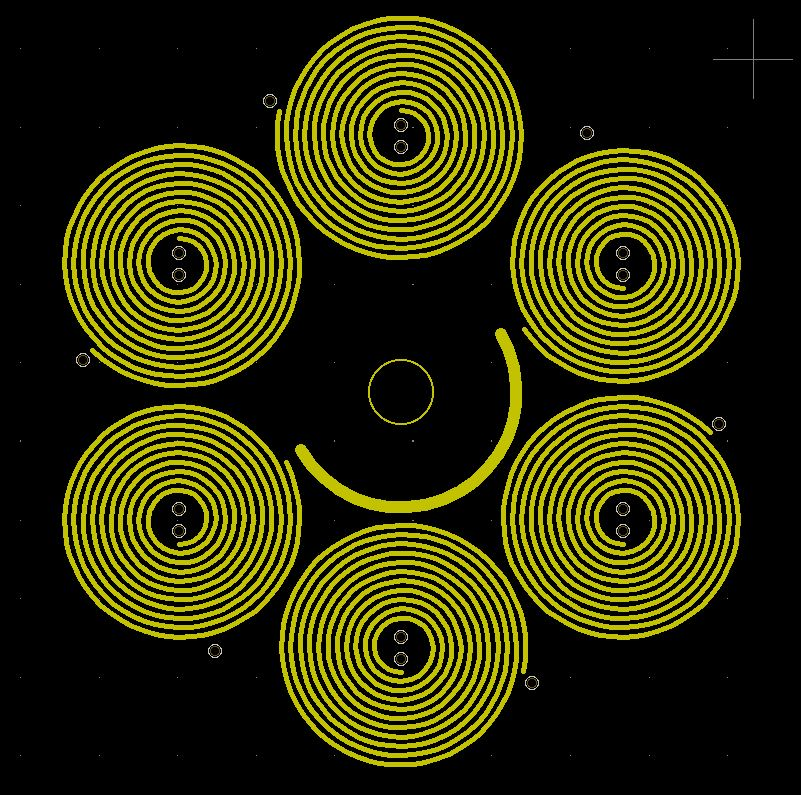

# PCB Motors

Packages to generate a PCB motor, Carl Bugeja style, for KiCad using Python

## History

Carl Bugeja shared several projects where eletric motors are made directly using PCBs,
see [Hackaday](https://hackaday.io/CarlBugeja), [Youtube](https://www.youtube.com/c/CarlBugeja)
Drawing these circuits can be a pain. This scripts automates the fabrication and gives an
estimate for the coil resistance, magnetic field strength and heating.
Note, I am mainly interested in PCB motors to spin prisms.

## Install
Install poetry and python
```console
sudo apt install python3 python3-pip
curl -sSL https://raw.githubusercontent.com/python-poetry/poetry/master/get-poetry.py | python3 -
```
Use poetry to install the dependencies in pyproject.toml
```console
poetry install
```
Change parameters in the script and run it
```console
poetry run python spiral.py
```
The script modifies the base_kicad_pcb and creates a spiral.kicad_pcb.
This can be opened with KiCad and should contain the motor.
This design can be attached to another pcb via Kicad PCB import method.
This feature is only available if KiCad PCB is run in standalone mode. Disable the rat's net before doing so.
At the moment, the user still needs to add connect the coils using the via's.  
It can also be useful to change set the net to the same number as the one you plan to use in the final layout.

## Working of the motor

The magnetic field of a circular ring is shown below;
.
The idea is that there are six magnets attached under the motor.
These magnets are in pairs of north and south. Opposing magnets have the same field.
The coils in the motor can be; north, south or neutral.  Opposing coils give the same field.
The motor can be in three states; (North, South, Neutral), (South, Neutral, North) and (Neutral, North, Soutch).
This drags the rotor over the stator.

## Results

Script creates a 4 layer PCB motor with 6 poles.
The front copper layer is shown below,  
  
The In1.Cu layer is shown below. The style of these connections is named "Carl Bugeja" styled PCBs.  
  

## Video

[](http://www.youtube.com/watch?v=_efIdr1Gv64 "Video working board")

## Control software

Gateware to pulse the motor can be found [here](https://github.com/hstarmans/hexastorm/tree/master/tests/custommotor).
